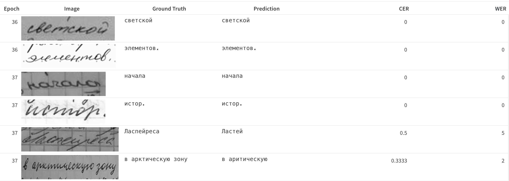
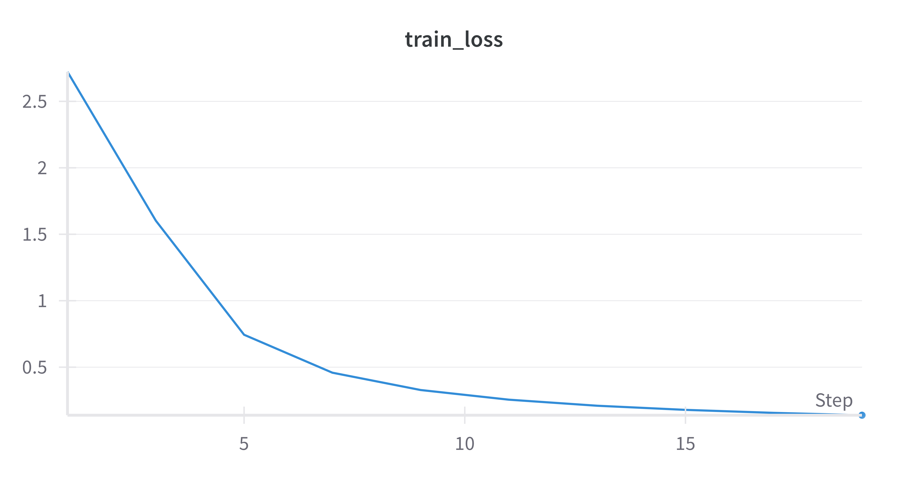
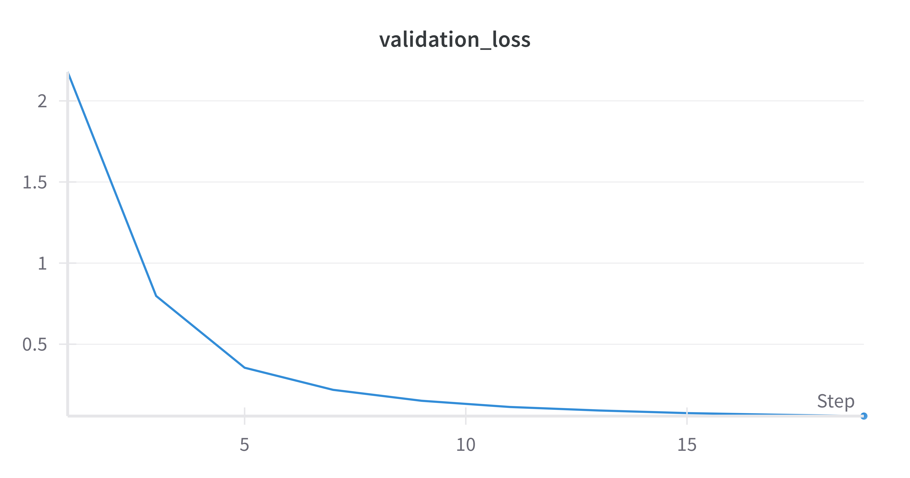
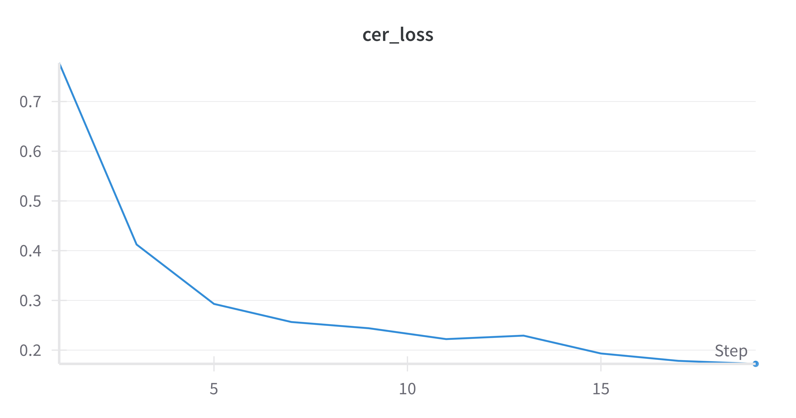
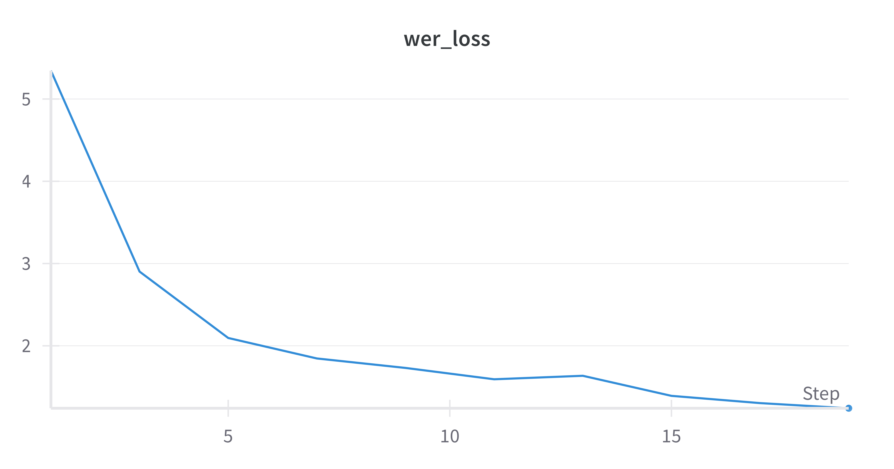
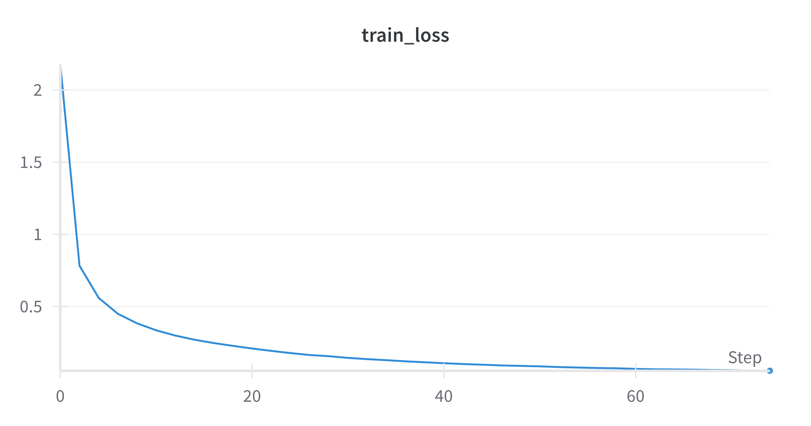
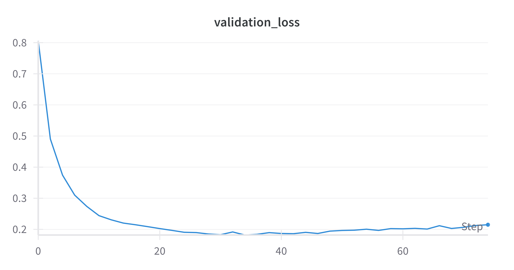
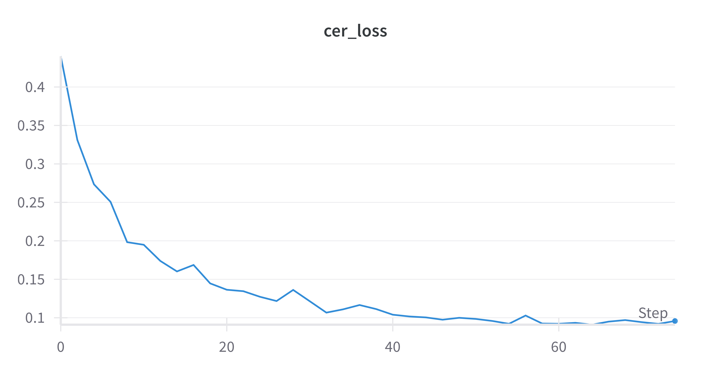
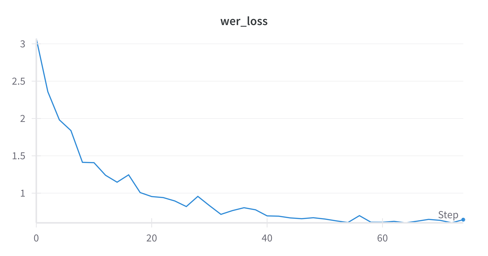

# Cyrillic-OCR

An end-to-end text recognition neural network.

## Introduction

This project implements a text recognition neural network, specialized in handwritten Cyrillic text.


## Architecture

Then neural network consists of two alterable components:

- `Backbone` - extracts features from the input images
  - `CNN` - a convolutional neural network or
  - `DeformableCNN` - a deformable convolution neural network
- `OCRModel` - a wrapper around the backbone and the transformer. The transformer received the backbone's input and converts the extracted features into meaningful sequences of characters
- `OCRModelWrapper` - a wrapper around the model, carrying the model configuration and hyperparameters and enabling inference on image input

Additionally, the project consists of several other useful modules:

- `NaturalDataloader` - a custom dataloader for the Cyrillic Handwriting Dataset
- `SyntheticDataloader` - a custom dataloader for the Synthetic Cyrillic Large Dataset
- `OCRModelConfig` - a configuration for the model including:
  - alphabet and special tokens
  - backbone type
  - number of hidden transformer layers
  - number of encoding and decoding transformer layers
  - number of transformer heads
  - dropout probability
  - input image dimensions
  - mean and standard deviation of the datasets, processed to grayscale
- a simple GUI enabling the user to upload an image and receive a text prediction

## Implementation

The neural network was implemented using ***Pytorch***. The project uses the `uv` package manager for effective dependency management. The data during training is stored and aggregated using ***Weights and Biases***. The GUI is implemented using ***Flask***, ***HTML***, ***JS*** and ***Tailwind CSS***.

```txt
CyrillicOCR
├── data
│   ├── preprocessed
│   │   ├── test
│   │   ├── test.tsv
│   │   ├── train
│   │   └── train.tsv
│   └── raw
│       ├── test
│       ├── test.tsv
│       ├── train
│       └── train.tsv
├── gui
│   ├── app.py
│   ├── static
│   │   ├── bg1.png
│   │   └── script.js
│   └── templates
│       └── index.html
├── src
│   ├── __init__.py
│   ├── backbones
│   │   ├── __init__.py
│   │   ├── cnn.py
│   │   └── deformable_cnn.py
│   ├── config
│   │   ├── __init__.py
│   │   ├── backbone_type.py
│   │   ├── model_config.py
│   │   ├── resnet_type.py
│   │   └── train_config.py
│   ├── models
│   │   ├── __init__.py
│   │   ├── ocr_model_wrapper.py
│   │   └── ocr_model.py
│   ├── scripts
│   │   ├── __init__.py
│   │   ├── calculate_dataset_stats.py
│   │   ├── mps.py
│   │   ├── preprocess_images.py
│   │   └── train_test.py
│   └── utils
│       ├── __init__.py
│       ├── collate.py
│       ├── error_rates.py
│       ├── label_text_mapping.py
│       ├── natural_dataset.py
│       ├── resize_and_pad.py
│       ├── synth_dataset.py
│       ├── test_utils.py
│       └── train_utils.py
├── pyproject.toml
├── uv.lock
└── README.md
```

## Training

The neural network was trained on a rented (via [vast.ai](vast.ai)) `Nvidia H100 80GB HBM3` GPU.



### Datasets

The following datasets were used:

| Name                                                                                                                           | Size          |
| ------------------------------------------------------------------------------------------------------------------------------ | ------------- |
| [pumb-ai/cyrillic-handwritten-large](https://huggingface.co/datasets/pumb-ai/synthetic-cyrillic-large)                         | 3 800 000\*\* |
| [constantinwerner/cyrillic-handwriting-dataset](https://www.kaggle.com/datasets/constantinwerner/cyrillic-handwriting-dataset) | 73 830        |

\* Both datasets contain only train and test splits. The train splits were further divided into train and validation parts in a 95-5 ratio.

\*\* Due to resource constraints, only 25% of the synthetic dataset were used for pretraining.

### Hyperparameters

Due to limited time and financial resources, experiments were conducted using only the following combination of hyperparameters:

| Hyperparameter         | Description                           | Value                                                        |
| ---------------------- | ------------------------------------- | ------------------------------------------------------------ |
| `backbone_type`        | The CNN backbone type                 | RESNET_50                                                    |
| `hidden`               | Number of transformer hidden layers   | 512                                                          |
| `enc_layers`           | Number of transformer encoding layers | 5                                                            |
| `dec_layers`           | Number of transformer decoding layers | 4                                                            |
| `nhead`                | Number of transformer heads           | 8                                                            |
| `dropout`              | Dropout probability in transformer    | 0.1                                                          |
| `width`                | Input image width                     | 256                                                          |
| `height`               | Input image height                    | 64                                                           |
| `max_length`           | The maximum output sequence length    | 100                                                          |
| `natural_mean`         | Grayscale natural dataset mean        | [0.7564554810523987, 0.7564554810523987, 0.7564554810523987] |
| `natural_std`          | Grayscale dataset st. dev.            | [0.2374454289674759, 0.2374454289674759, 0.2374454289674759] |
| `synthetic_mean`       | Grayscale synth dataset mean          | [0.7564554810523987, 0.7564554810523987, 0.7564554810523987] |
| `synthetic_std`        | Grayscale synth dataset mean          | [0.2374454289674759, 0.2374454289674759, 0.2374454289674759] |
| `synthetic_batch_size` | Batch size of the synth dataset       | 128                                                          |
| `natural_batch_size`   | Batch size of the synth dataset       | 128                                                          |
| `synthetic_lr`         | Learning rate during pretraining      | 2e-4                                                         |
| `natural_lr`           | Learning rate during fine-tuning      | 2e-4                                                         |
| `synthetic_decay_rate` | Decay rate during pretraining         | 0.01                                                         |
| `natural_decay_rate`   | Decay rate during fine-tuning         | 0.01                                                         |
| `synthetic_epochs`     | Number of epochs during pretraining   | 10                                                           |
| `natural_epochs`       | Number of epochs during fine-tuning   | 50                                                           |
| `patience`             | The epochs before early stopping      | 5                                                            |

### Results

#### Pretraining

Trained for 10 epochs on 25% of the synthetic dataset.

| Metric          | Value   |
| --------------- | ------- |
| Training loss   | 0.1384  |
| Validation loss | 0.0570  |
| Validation CER  | 0.1784  |
| Validation WER  | 1.2408  |
| Training Time   | 80 mins |

|                                                          |                                                        |
| -------------------------------------------------------- | ------------------------------------------------------ |
|  |  |
|                |              |

#### Fine-tuning

Early stopping at epoch 37 after 5 epochs without improvement.

| Metric          | Value   |
| --------------- | ------- |
| Training loss   | 0.0546  |
| Validation loss | 0.2148  |
| Validation CER  | 0.0958  |
| Validation WER  | 0.6449  |
| Training Time   | 25 mins |

|                                                         |                                                       |
| ------------------------------------------------------- | ----------------------------------------------------- |
|  |  |
|                |              |

#### Test Results

| Metric   | Value  |
| -------- | ------ |
| Test CER | 0.1590 |
| Test WER | 1.1698 |

## Conclusion

This project demonstrates the usefulness of the CNN-Transformer architecture for text recognition. In spite of the limited available resources and an a single "blind" guess of suitable hyperparameter values, the model achieves an adequate accuracy on all dataset splits. The project can be developed further by:

- experimenting with different hyperparameter combinations (this project considered only one combination due to resource constraints)
- using 100% of the synthetic dataset (this project only used 25%)
- experimenting with a deformable convolution backbone (this project implements it, but does not experiment with it)
- using alternative or additional datasets
